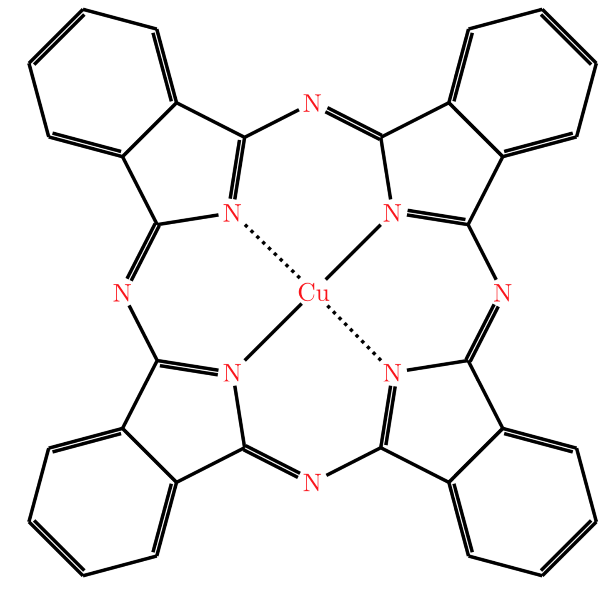

# ChemFig Phthalocyanine

LaTeX document to generate Phthalocyanine and related molecules using the ChemFig package.

The rendered copper Phthalocyanine molecule looks as follows:

The water-soluble version is here:

